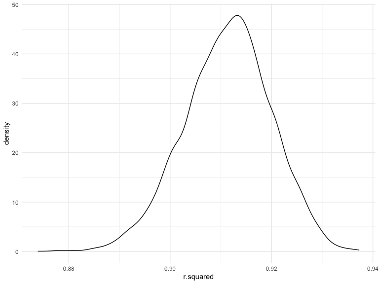
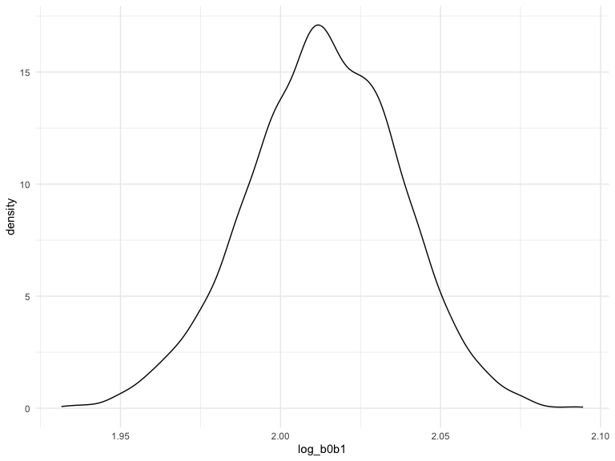
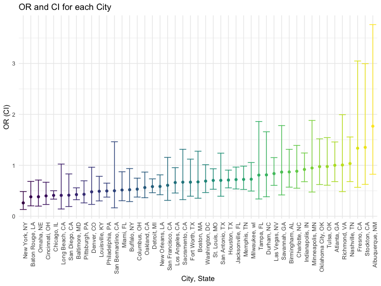
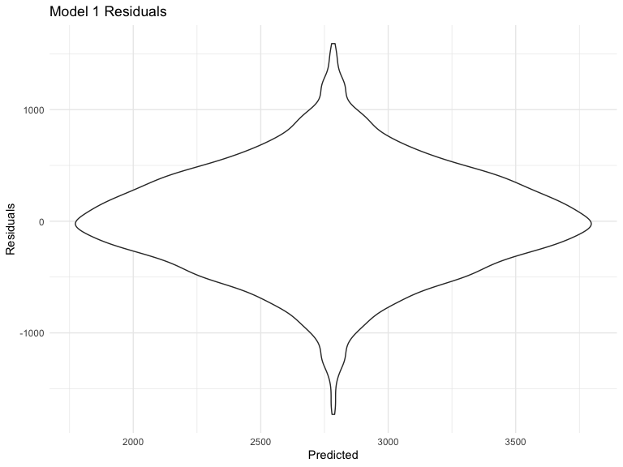
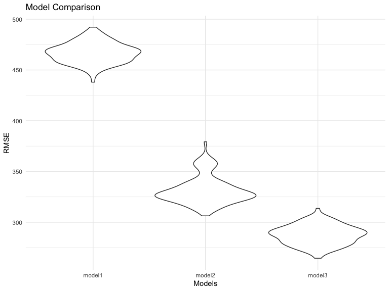

p8105_hw6_SC4934
================
Sophia Chkonia
2022-12-01

# Problem 1

``` r
weather_df = 
  rnoaa::meteo_pull_monitors(
    c("USW00094728"),
    var = c("PRCP", "TMIN", "TMAX"), 
    date_min = "2017-01-01",
    date_max = "2017-12-31") %>%
  mutate(
    name = recode(id, USW00094728 = "CentralPark_NY"),
    tmin = tmin / 10,
    tmax = tmax / 10) %>%
  select(name, id, everything())
```

``` r
set.seed(1)

weather_df %>% 
  modelr::bootstrap(n = 5000) %>% 
  mutate(
    models = map(strap, ~lm(tmax ~ tmin, data = .x) ),
    results = map(models, broom::glance)) %>% 
  select(-strap, -models) %>% 
  unnest(results) %>% 
  ggplot(aes(x = r.squared)) + geom_density()
```



In this example, the $\hat{r}^2$ value is high (around 45), and the
upper bound at 1 may be a cause for the generally skewed shape of the
distribution.

the 2.5% and 97.5% quantiles of the estimates across the samples would
allow us to construct confidence intervals for $R^2$. As the shape is
asymmetric, using the mean +/- 1.96 times the standard error wouldn’t
work.

``` r
weather_df %>% 
  modelr::bootstrap(n = 5000) %>% 
  mutate(
    models = map(strap, ~lm(tmax ~ tmin, data = .x) ),
    results = map(models, broom::tidy)) %>% 
  select(-strap, -models) %>% 
  unnest(results) %>% 
  select(id = `.id`, term, estimate) %>% 
  pivot_wider(
    names_from = term, 
    values_from = estimate) %>% 
  rename(beta0 = `(Intercept)`, beta1 = tmin) %>% 
  mutate(log_b0b1 = log(beta0 * beta1)) %>% 
  ggplot(aes(x = log_b0b1)) + geom_density()
```



this distribution is also slightly skewed.

# Problem 2

## import and tidy

``` r
homicide = 
read_csv(
  "data/homicide-data.csv"
) %>% 
  janitor::clean_names() %>% 
  mutate(
    city_state = str_c(city, ", ", state),
    solved = case_when(disposition == "Closed by arrest"  ~ 1, disposition == "Open/No arrest" | disposition == "Closed without arrest" ~ 0 ),
    victim_age = as.integer(victim_age)) %>% 
  subset(city_state != "Tulsa, AL", city_state != "Dallas, TX" & city_state != "Phoenix, AZ" & city_state != "Kansas City, MO") %>% 
  filter(victim_race %in% c("White", "Black"))
```

## Regression

``` r
baltimore = homicide %>% 
  filter(city_state == "Baltimore, MD")

fit_logistic = 
  baltimore %>% 
  glm(solved ~ victim_age + victim_race + victim_sex, data = ., family = binomial()) 

fit_logistic %>% 
  broom::tidy() %>% 
  mutate(OR = exp(estimate),
         conf.low = exp(estimate - 1.96*std.error),
         conf.high = exp(estimate + 1.96*std.error)) %>% 
  select(term, OR, conf.low, conf.high) %>% 
  knitr::kable(digits = 3) 
```

| term             |    OR | conf.low | conf.high |
|:-----------------|------:|---------:|----------:|
| (Intercept)      | 1.363 |    0.975 |     1.907 |
| victim_age       | 0.993 |    0.987 |     1.000 |
| victim_raceWhite | 2.320 |    1.648 |     3.268 |
| victim_sexMale   | 0.426 |    0.325 |     0.558 |

The adjusted odds ratio is 0.426, and the confidence interval is (0.325,
0.558).

Homicides in which the victim is Male are substantially less likely to
be resolved compared to homicides in which the victim is female, keeping
all other variables fixed.

## Each city Regression

``` r
city_logistic = 
  homicide %>% 
  nest(data = -city_state) %>% 
  mutate(
    results = map(data, ~ glm(solved ~ victim_age + victim_race + victim_sex, data = ., family = binomial())), 
    results = map(results, broom::tidy, conf.int = TRUE)
  ) %>% 
  select(city_state, results) %>% 
  unnest(cols = results) %>% 
  mutate(OR = exp(estimate),
         conf.low = exp(conf.low),
         conf.high = exp(conf.high)) %>% 
  select(city_state, term, OR, conf.low, conf.high)
```

## Plot

``` r
city_logistic %>% 
  filter(term == "victim_sexMale") %>% 
  mutate(city_state = fct_reorder(city_state, OR)) %>% 
  ggplot(aes(x = city_state, y = OR, color = city_state)) +
  geom_point() +
  geom_errorbar(aes(ymin = as.numeric(conf.low), ymax = as.numeric(conf.high))) +
  labs(
    x = "City, State",
    y = "OR (CI)",
    title = "OR and CI for each City"
  ) +
    theme(axis.text.x = element_text(angle = 90, hjust = 1)) +
  theme(legend.position = "none")
```



The plot above shows the estimated odds ratio for solving homicides
comparing male victims to female victims, along with the confidence
intervals, for each city in the data set. The odds ratios are arranged
in an increasing trend, with New York, NY having the lowest and
Albuquerque, NM having the highest. Furthermore, for the cities that
have an odds ratio less than 1 (and significant, meaning the confidence
interval does not include the null value), homicides in which the victim
is Male are less likely to be resolved compared to homicides in which
the victim is female, while for the cities that have an odds ratio more
than one (and significant), homicides in which the victim in Male are
more likely to be resolved compared to homicides in which the victim is
female, holding other variables constant.

# Problem 3

## import and tidy

``` r
birthweight = 
read_csv(
  "data/birthweight.csv"
) %>% 
  janitor::clean_names() %>% 
  mutate(
    babysex = as.factor(ifelse(babysex == 1, "Male", "Female")),
    mrace = as.factor(case_when(mrace == 1 ~ "White", mrace == 2 ~ "Black", mrace == 3 ~ "Asian",      mrace == 4 ~ "Puerto Rican", mrace == 8 ~ "Other")),
    malform = as.factor(ifelse(malform == 1, "Present", "Absent")))
```

## Regression

``` r
model1 = 
  birthweight %>% 
  lm(bwt ~ gaweeks, data = .)


birthweight %>% 
  modelr::add_residuals(model1) %>% 
  modelr::add_predictions(model1) %>% 
  ggplot(aes(x = pred, y = resid)) + geom_violin() + 
  labs(
    title = "Model 1 Residuals",
    x = "Predicted",
    y = "Residuals"
  )
```



The regression model `model1` examines birthweight as outcome (`bwt`),
and gestational age in weeks `gaweeks` as a predictor, as low
gestational age is hypothesized to be linked to low birth weight. As the
outcome is a continuous variable, I used a linear model `lm`.

## Comparison

``` r
model_df = 
  crossv_mc(birthweight, 100) %>% 
  mutate(
    train = map(train, as_tibble),
    test = map(test, as_tibble))

model_df = 
  model_df %>% 
  mutate(
    model1 = map(train, ~ lm(bwt ~ gaweeks, data = .)),
    model2 = map(train, ~ lm(bwt ~ blength + gaweeks, data = .)),
    model3 = map(train, ~ lm(bwt ~  bhead + blength + babysex + bhead*blength + blength*babysex +
                               bhead*babysex + bhead*blength*babysex, data = . ))) %>% 
    mutate(
      rmse_model1 = map2_dbl(model1, test, ~rmse(model = .x, data = .y)),
      rmse_model2 = map2_dbl(model2, test, ~rmse(model = .x, data = .y)),
      rmse_model3 = map2_dbl(model3, test, ~rmse(model = .x, data = .y)))
    
model_df %>% 
  select(starts_with("rmse")) %>% 
  pivot_longer(
    everything(),
    names_to = "model", 
    values_to = "rmse",
    names_prefix = "rmse_") %>% 
  mutate(model = fct_inorder(model)) %>% 
  ggplot(aes(x = model, y = rmse)) + geom_violin() +
  labs(
    title = "Model Comparison",
    x = "Models",
    y = "RMSE"
  )
```



Model 3 had the lowest rmse (around 280), while model 1 had the highest
rmse (around 480). This shows that model 3 was best fit out of the
models.
